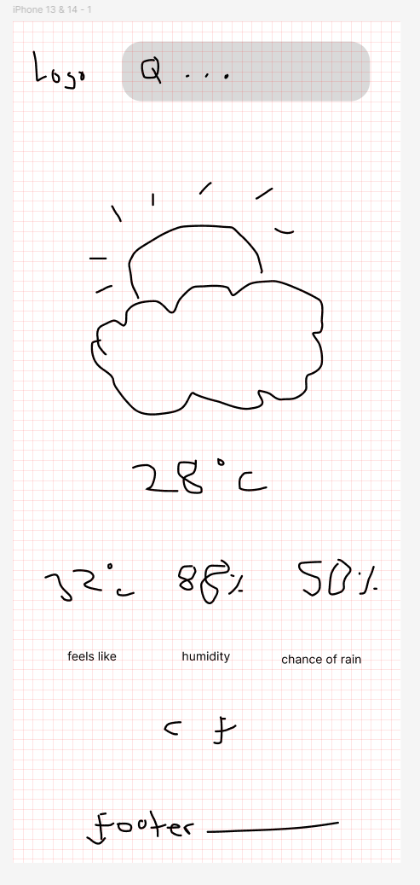

# Weather App

Uses everything learned so far to create a weather forecast site using the [Visual Crossing API](https://www.visualcrossing.com/).

## Requirements

- Search for and display weather for a specific location. ✅
- Toggle information between farenheit and celcius. ✅
- Look of the page should change depending on the weather. ⛔️
- Uses async/await. ✅
- Mobile first design. ✅

## Steps

- Write the functions that process the JSON data you’re getting from the API and return an object with only the data you require for your app.
- Set up a form that will let users input their location and will fetch the weather info (still just console.log() it).
- While you don’t have to, if you wish to display weather icons then there can be a lot of them to import, so have a look at the dynamic import() function. Unlike plain template strings without an import, Webpack can read dynamic imports and still bundle all the relevant assets.
- Add any styling you like!
- Optional: add a ‘loading’ component that displays from the time the form is submitted until the information comes back from the API. Use DevTools to simulate network speeds.

### Notes

## UI Mockups

### Mobile

## Webpack-Template

Template for future projects using webpack created by me.

#### Useful Commands

| Command                                      |              Function              |
| -------------------------------------------- | :--------------------------------: |
| npm install                                  | init dist and node_modules folders |
| npm start                                    |         npx webpack serve          |
| npm run build                                |          production build          |
| tree -I node_modules > project-structure.txt |         project structure          |

#### GitIgnore Config

node_modules

dist

project-structure.txt

#### Useful Links

[github md cheatsheet](https://github.com/adam-p/markdown-here/wiki/markdown-cheatsheet)

✅❌⛔️
